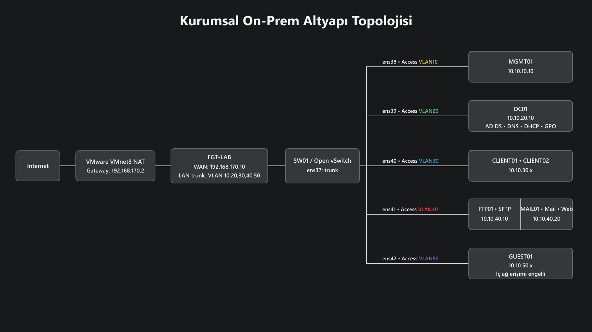

# Virtualized Corporate Network & Security Infrastructure

> Internship project — laboratory implementation of a virtualized corporate network, firewall, server and security infrastructure.

## Project Overview

This project demonstrates the design and implementation of a segmented corporate network in a virtualized environment. The infrastructure was built and tested using **VMware Workstation**, **FortiGate**, **Open vSwitch**, **Windows Server** and **Ubuntu Server**.

The main objective was to separate network segments, control inter-network traffic through firewall policies, provide centralized identity and network services, and test secure file transfer and mail services.

## Architecture


The laboratory network contains the following logical segments:

| VLAN | Segment | Network | Purpose |
|---|---|---|---|
| 10 | MANAGEMENT | 10.10.10.0/24 | IT management |
| 20 | SERVERS | 10.10.20.0/24 | Server infrastructure |
| 30 | USERS | 10.10.30.0/24 | Domain clients |
| 40 | DMZ | 10.10.40.0/24 | Public-facing/service segment |
| 50 | GUEST | 10.10.50.0/24 | Guest/test clients |
| 99 | NATIVE/BLACKHOLE | 10.10.99.0/24 | Unused/native VLAN |

All inter-VLAN routing is handled by FortiGate and controlled through firewall policies.

## Main Components

- **VMware Workstation** — virtualization platform
- **FortiGate VM** — firewall, routing, VLAN interfaces and security policies
- **Open vSwitch** — virtual Layer-2 switching
- **Windows Server** — Active Directory, DNS, DHCP and Group Policy
- **Windows 11 clients** — domain and guest test machines
- **Ubuntu Server** — SFTP/SSH, mail and web services
- **Postfix / Dovecot / Roundcube** — mail infrastructure
- **SHA-256** — backup/integrity verification

## Security Tests

The project includes tests for:

- Guest network isolation from internal resources
- Firewall policy enforcement
- SFTP access control
- Read-only vs. read-write SFTP permissions
- SSH/SFTP port filtering
- Active Directory and Group Policy operation
- DNS and DHCP functionality
- SMTP/IMAP/IMAPS connectivity
- TLS certificate validation
- Open-relay protection
- Mail delivery through Roundcube
- Backup integrity verification with SHA-256

## Repository Structure

```text
.
├── README.md
├── network/
│   └── network-topology.png
├── docs/
│   ├── ip-plan.md
│   ├── vm-inventory.md
│   └── security-architecture.md
└── screenshots/
    ├── network/
    ├── security/
    ├── windows-server/
    └── linux-mail/
```

## Important Note

The screenshots and network addresses in this repository belong to a **laboratory/virtualized environment** used for demonstration and testing.

No company credentials, production configuration backups, passwords, tokens or private keys are included in this repository.

The original FortiGate configuration backup was intentionally **excluded** because configuration backups can contain sensitive authentication and infrastructure information.

## Skills Demonstrated

**Networking:** VLAN, subnetting, DHCP, DNS, routing, firewall policies, traffic logging

**Cybersecurity:** network segmentation, access control, least privilege, isolation testing, TLS, log analysis, integrity verification

**Systems:** Active Directory, Group Policy, Windows Server, Ubuntu Server, OpenSSH/SFTP, Postfix, Dovecot, Apache, Roundcube

**Virtualization:** VMware Workstation, virtual network adapters, virtual machines and virtual switching
